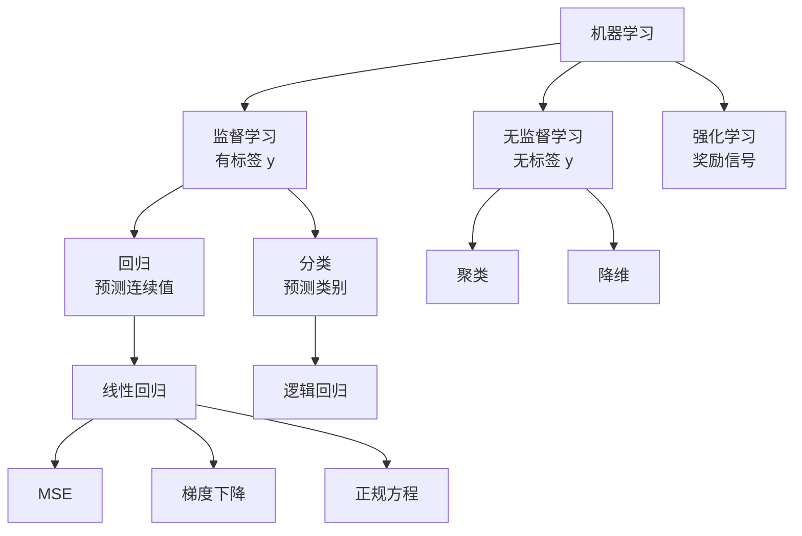

# Machine Learning

机器学习的共同语言是：从数据中选择一个函数，使它在未见数据上仍能完成预测或发现结构。

## 概念分区

### 🎯 监督学习

训练数据包含输入 $X$ 和标签 $y$。常见任务：

- **回归**：预测连续值，如房价；当前节点是 [[ML/Linear Regression/00 Linear Regression MOC|Linear Regression]]。
- **分类**：预测离散类别，下一步通常学习逻辑回归。

### 🧩 无监督学习

数据只有 $X$，目标是发现内部结构：

- **聚类**：例如 K-means，把相似样本放入同一组。
- **降维**：例如 PCA，以较少坐标保留主要变化；也可辅助高维数据的展示，但投影不是完整空间。
- **异常检测**：学习“正常”的数据分布，再识别罕见样本。

### 🎮 强化学习

智能体通过状态、动作和奖励学习策略。它与前两类的反馈形式不同，先作为路线中的后续分支。

## 接下来

按 [[01 Learning Roadmap]] 逐步学习；当前完整主题：[[ML/Linear Regression/00 Linear Regression MOC|Linear Regression]]。
