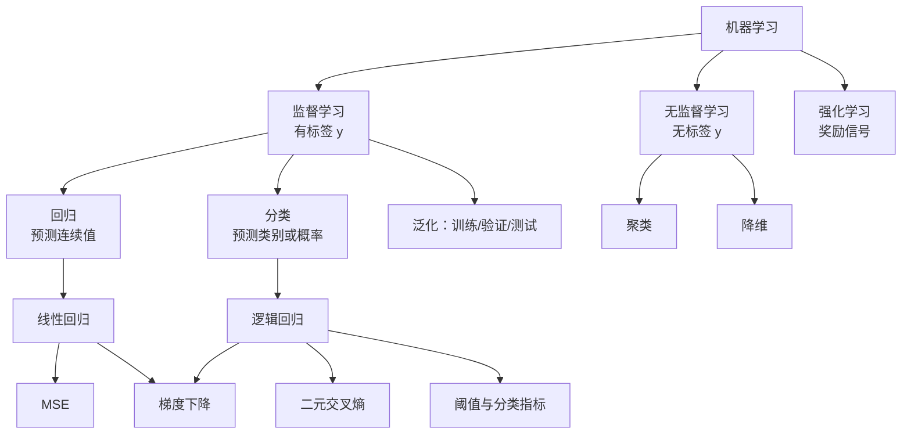

# Machine Learning

机器学习的共同语言是：从数据中选择一个函数，使它在未见数据上仍能完成预测或发现结构。

## 🎯 监督学习

训练数据包含输入 $X$ 和标签 $y$：

- **回归**：预测连续值；已完成 [[ML/Linear Regression/00 Linear Regression MOC|Linear Regression]]。
- **分类**：预测类别或类别概率；已完成 [[ML/Logistic Regression/00 Logistic Regression MOC|Logistic Regression]]。
- 两者都需要独立数据评估泛化，不能只看训练损失。

## 🧩 无监督学习

数据只有 $X$，目标是发现结构：

- **聚类**：例如 K-means，把相似样本归为一组。
- **降维**：例如 PCA，以较少坐标保留主要变化；投影不等于完整原空间。
- **异常检测**：学习正常分布，再识别罕见样本。

## 🎮 强化学习

智能体通过状态、动作和奖励学习策略。其反馈不是逐样本标签，作为后续分支。

继续：[[01 Learning Roadmap]]。
