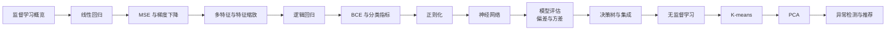

# 学习路线：从监督到无监督

这是一条贴近吴恩达常见教学脉络、便于亲手复现的路线，不声称逐课复刻某一版课程目录。

## 当前阶段

1. [[ML/Linear Regression/00 Linear Regression MOC|Linear Regression]]：已完成回归的模型—损失—优化闭环。
2. [[ML/Logistic Regression/00 Logistic Regression MOC|Logistic Regression]]：已完成概率分类、BCE、正则化、阈值与基础诊断。
3. **下一步：神经网络基础**——把逻辑回归视为一个神经元，再理解隐藏层与反向传播。
4. 随后系统整理模型评估、偏差/方差与学习曲线，再进入树模型和无监督学习。

> [!tip] 每个主题的复现模板
> 问题类型 → 数据划分 → 假设函数 → 目标函数 → 优化方法 → 向量化 → 基线库实现 → 泛化诊断。
