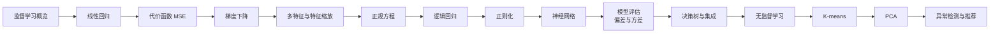

# 学习路线：从监督到无监督

这是一条贴近吴恩达课程讲解习惯、又便于亲手复现的路线；它是学习地图，不声称逐课复刻某一版课程目录。

## 当前阶段

1. [[ML/Linear Regression/00 Linear Regression MOC|Linear Regression]]：先把“模型—损失—优化—实现”闭环走通。
2. 逻辑回归：把同一套思路迁移到分类。
3. 正则化、诊断与模型选择：从“能拟合”进入“能泛化”。
4. 无监督学习：理解没有标签时如何定义目标。

> [!tip] 每个主题的复现模板
> 问题类型 → 假设函数 → 目标函数 → 优化方法 → 向量化 → 基线库实现 → 可视化诊断。
