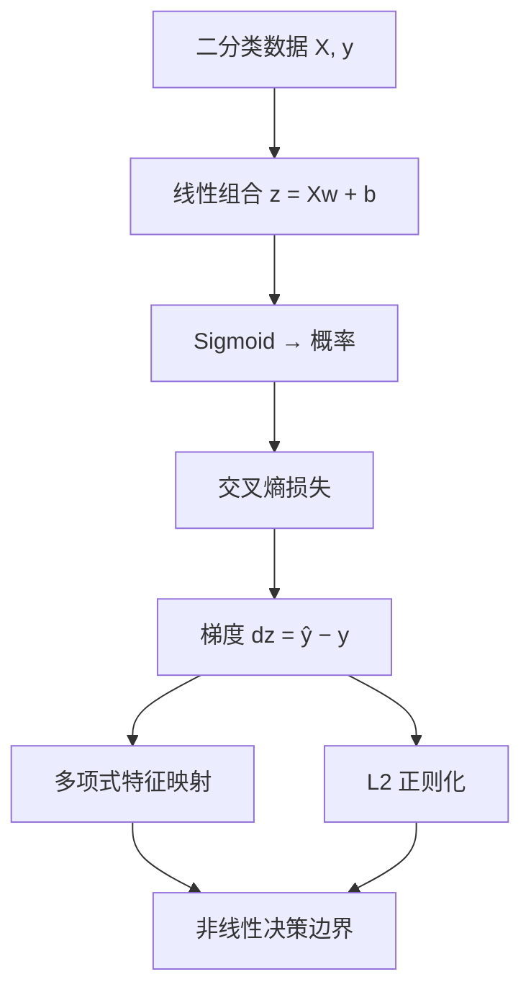

# 🧭 逻辑回归

逻辑回归是[[ML/00 ML Index|监督学习]]中的**分类**算法：名字带"回归"，实际做的是用线性组合 + Sigmoid 输出**类别概率**。它与[[ML/Linear Regression/00 Linear Regression MOC|线性回归]]共享同一套"模型—损失—优化—实现"闭环，是迁移学习思路的最佳练习。

## 阅读顺序

1. [[01 从回归到分类：Sigmoid 与概率]]
2. [[02 交叉熵损失与梯度]]
3. [[03 多项式特征映射与决策边界]]
4. [[04 L2 正则化与过拟合]]
5. [[05 NumPy 与 sklearn 对照]]
6. [[Code/logistic_regression.py|可运行代码]]

## 一页速记

| 对象 | 记号 | 含义 |
|---|---:|---|
| 线性组合 | $z=Xw+b\mathbf1$ | 与线性回归同形的打分 |
| 激活 | $a=\sigma(z)=\dfrac{1}{1+e^{-z}}$ | 输出 $P(y=1\mid x)$ |
| 决策 | $\hat y=\mathbf1[a\ge0.5]$ | 概率阈值切分类别 |
| 正则强度 | $\lambda$ | 越大越抑制高阶项 |

核心公式（BCE + L2）：

$$L=-\frac1m\sum_{i=1}^m\big[y_i\ln a_i+(1-y_i)\ln(1-a_i)\big]
+\frac{\lambda}{2m}\lVert w\rVert_2^2$$

$$dz=a-y,\qquad
\nabla_wL=\frac1mX^T(a-y)+\frac{\lambda}{m}w,\qquad
\frac{\partial L}{\partial b}=\operatorname{mean}(a-y)$$

> [!important] bias 不参与正则化
> $\nabla_wL$ 里有 $\frac{\lambda}{m}w$，而 $\frac{\partial L}{\partial b}$ 没有。正则化的目的是压制特征对应的高阶项复杂度，截距只是整体平移，不该被拉向 0。

为什么输出是概率而不是直接输出类别：[[01 从回归到分类：Sigmoid 与概率]]。
