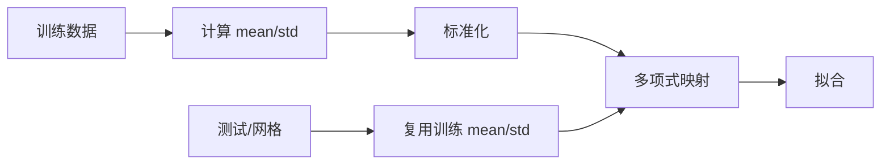

# 多项式特征与非线性决策边界

## 原始线性边界的限制

两个原始特征下，$z=w_1x_1+w_2x_2+b=0$ 是直线，无法分开交错月牙。可以先做固定映射：

$$\phi(x_1,x_2)=[x_1,x_2,x_1^2,x_1x_2,x_2^2,\ldots]$$

然后训练 $p=\sigma(\phi(X)w+b)$。模型对 $w$ 仍是线性的，但映回原始坐标后，$\phi(x)^Tw+b=0$ 可以是曲线。

degree 为 $r$、不含常数项时，两个输入映射后的特征数为：

$$d'=\binom{r+2}{2}-1$$

本例 $r=6$，因此有 $27$ 个映射特征。

## 正确的数据管线

必须注意：

1. 先划分训练/测试集；均值和标准差只从训练集得到，避免数据泄漏。
2. 训练点、测试点和绘图网格使用完全相同的标准化和特征映射。
3. 高阶特征尺度容易爆炸，标准化能显著改善梯度下降条件数。

## 如何读决策边界图

![[Assets/logistic_regression_decision_boundary.png]]

- 颜色表示 $P(y=1\mid x)$，黑线是 $p=0.5$。
- 圆点为训练集，叉号为测试集，便于观察泛化而不只是训练拟合。
- 二维输入上的硬决策边界可以完整画在平面上；概率作为第三个量用颜色编码。
- 数据分布以外的颜色和弯曲属于**外推**，高阶多项式可能在那里表现怪异，不应过度解释。

degree 越高并非越好；它必须与 [[L2 正则化、容量与过拟合|正则化]] 和 [[评估指标与模型诊断|测试集诊断]] 一起看。

