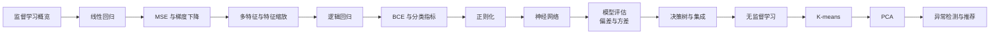

# 学习路线：从监督到无监督

这是一条根据现有代码和实验逐步整理的路线，不预设固定课程目录；后续主题以实际复现和问题记录为准。

## 当前阶段

1. [[MachineLearning/Linear Regression/Linear Regression MOC|Linear Regression]]：已完成回归的模型—损失—优化闭环。
2. [[MachineLearning/Logistic Regression/Logistic Regression MOC|Logistic Regression]]：已完成概率分类、BCE、正则化、阈值与基础诊断。
3. [[MachineLearning/Neural Network/Neural Network MOC|神经网络入门实验]]：已有两个特征的二分类数据、训练/测试集与 Keras 配套代码；反向传播的完整推导仍是下一步。
4. 随后系统整理模型评估、偏差/方差与学习曲线，再进入树模型和无监督学习。

> [!tip] 每个主题的复现模板
> 问题类型 → 数据划分 → 假设函数 → 目标函数 → 优化方法 → 向量化 → 基线库实现 → 泛化诊断。
