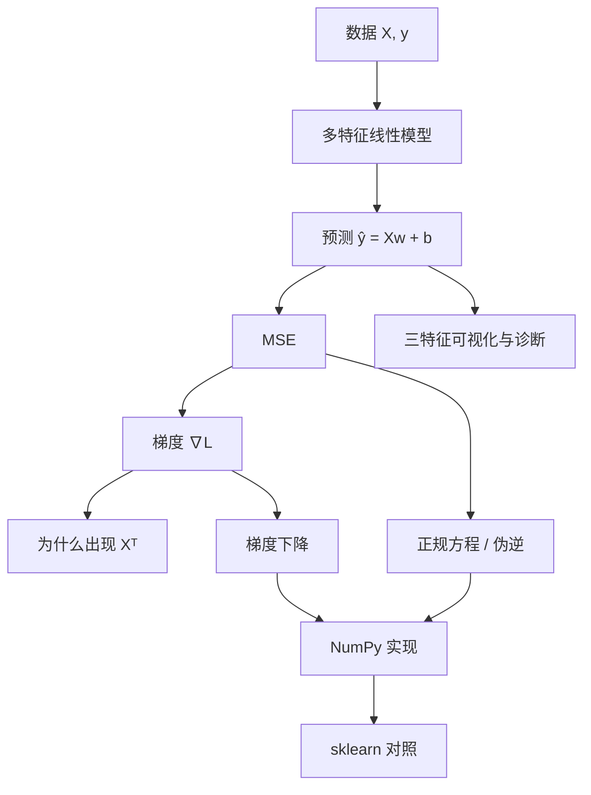

# 📈 线性回归

线性回归是[[MachineLearning/ML Index|监督学习]]中的**回归**算法：用特征的加权和预测连续值。它非常适合建立机器学习的第一条完整知识链。

## 阅读顺序

1. [[多特征线性模型与维度]]
2. [[MSE 与梯度]]
3. [[为什么梯度里有 X 转置]]
4. [[梯度下降与正规方程]]
5. [[NumPy 与 sklearn 对照]]
6. [[三特征可视化]]
7. [[Code/linear_regression_numpy.py|可运行代码]]

## 一页速记

| 对象 | 形状 | 含义 |
|---|---:|---|
| $X$ | $n\times d$ | $n$ 个样本、$d$ 个特征 |
| $w$ | $d\times1$ | 每个特征一个权重 |
| $b$ | 标量 | 所有样本共享的截距 |
| $y,\hat y,e$ | $n\times1$ | 真实值、预测值、误差 |

核心公式：

$$\hat y=Xw+b\mathbf 1$$

$$L=\frac1n\lVert \hat y-y\rVert_2^2$$

$$\nabla_wL=\frac2nX^T(\hat y-y),\qquad \frac{\partial L}{\partial b}=\frac2n\mathbf1^T(\hat y-y)$$

